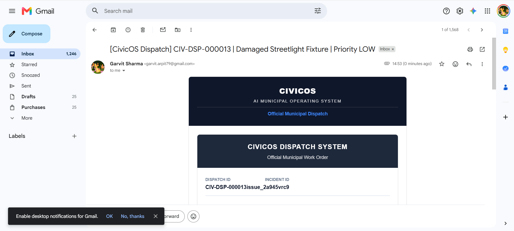

# CivicOS
### Autonomous Civic Intelligence Platform

> Transforming municipal governance through Agentic AI, deterministic intelligence engines, and real-time civic operations.

---

## Overview

CivicOS is an end-to-end Autonomous Civic Intelligence Platform that assists municipalities in transforming citizen reports into actionable municipal operations.

Instead of acting as a traditional complaint management system, CivicOS combines multimodal AI perception with deterministic municipal intelligence engines to assist administrators in prioritizing incidents, estimating operational impact, dispatching work orders, and monitoring execution in real time.

The platform demonstrates how AI can augment public administration while preserving explainability, human oversight, and operational consistency.

---

# Demo

🎥 Demo Video

https://drive.google.com/file/d/1Rd0DjKccV8ypakjg52qTz2NtcoE_ivnF/view

🌐 Live Application

https://civicos-314163581128.asia-east1.run.app

📄 Documentation

https://docs.google.com/document/d/1sXU2FyDQi7izfWy8KSJiKRiOteDAA7ZAMNCNKm6U70o/edit?tab=t.0#heading=h.lhj9ydbh70el

---

# Architecture


The platform follows a hybrid AI architecture where Gemini performs multimodal perception while deterministic intelligence engines make operational municipal decisions.

---

# AI Processing Pipeline


Citizen Report

↓

Gemini Vision

↓

Structured Perception JSON

↓

Deterministic Municipal Intelligence

↓

Firestore Registry

↓

Executive Dashboard

↓

Dispatch Engine

↓

Citizen Verification

---

# Key Features

✅ AI Vision Based Issue Detection

- Image understanding using Gemini Vision
- Confidence estimation
- Hazard detection
- Infrastructure classification

---

✅ Deterministic Municipal Intelligence

Independent intelligence engines compute:

- Priority
- Department Routing
- SLA
- Repair Cost
- Operational Score

No operational decisions are delegated to the LLM.

---

✅ Executive Command Center

Real-time operational dashboard including

- Municipal KPIs
- Department Workload
- Budget Exposure
- SLA Monitoring
- Registry Statistics
- Executive Intelligence

---

✅ Geographic Intelligence

- Live Google Maps integration
- Incident visualization
- Severity filters
- Operational hotspots
- Spatial intelligence

---

✅ Commissioner Copilot

Grounded executive assistant capable of

- Daily summaries
- Operational recommendations
- Budget analysis
- Department insights
- Executive reasoning

---

✅ Incident Execution Center

Complete municipal workflow

- Approval
- Dispatch
- Crew assignment
- Status tracking
- Completion lifecycle

---

✅ Gmail Work Order Dispatch

Automatically generates official municipal work orders and dispatches them using Gmail API.

Includes

- Priority
- Department
- Cost
- SLA
- Executive Notes
- PDF Attachment

---

# Screenshots


## 🖥️ Executive Command Center


---

## 🤖 AI Vision Analysis


---

## 📊 Executive Dashboard & Decision Timeline


---

## 🌍 Operations Advisor


---

## 🧠 Commissioner Copilot


---

## 🚨 Incident Execution Center


---


## 📨 Automated Dispatch Preview

This is the AI-generated municipal work order preview before dispatch, allowing administrators to review the generated communication prior to approval.


---

## 📧 Live Gmail Work Order Dispatch

Once approved, CivicOS automatically dispatches an official municipal work order using the Gmail API, complete with issue details, department assignment, SLA, repair estimates, and actionable instructions.



---

## 💰 Cost of Inaction Engine


---

## 👥 Nearby Citizen Verification


---

# Technical Architecture

CivicOS intentionally separates AI perception from operational decision making.

Gemini is responsible for:

- Visual understanding
- Executive reasoning
- Summarization
- Natural language interaction

Deterministic Intelligence Engines are responsible for:

- Priority
- Department allocation
- SLA
- Financial estimation
- Operational scoring

This architecture minimizes hallucinations while maintaining explainability.

---

# Technology Stack

## Frontend

- React
- TypeScript
- Tailwind CSS
- Vite

## Backend

- Node.js
- Express

## Database

- Cloud Firestore

## AI

- Google Gemini Vision
- Gemini API

## Cloud

- Google AI Studio
- Google Cloud

## Maps

- Google Maps Platform

## Authentication

- Firebase Authentication

## Communication

- Gmail API

---

# Google Technologies Used

- Google Gemini API
- Google AI Studio
- Cloud Firestore
- Firebase Authentication
- Google Maps Platform
- Gmail API
- Google Cloud

---

# Design Principles

- Human-in-the-loop approval
- Explainable AI
- Deterministic governance
- Real-time synchronization
- Modular intelligence engines
- Production-oriented architecture

---

# Future Roadmap

- Duplicate incident detection
- Predictive civic analytics
- Smart dispatch optimization
- Citizen notification engine
- Semantic municipal search
- Multi-city deployment
- IoT sensor integration

---


# Repository Structure

```
client/
server/
firebase/
docs/
README.md
---

# Author

**Garvit Sharma**

B.Tech Computer Science & Engineering

Bharati Vidyapeeth College of Engineering, Pune

---

## Built for

**Vibe2Ship Hackathon 2026**

Problem Statement: **Community Hero – Hyperlocal Problem Solver**

Leveraging Google Gemini, Google Maps Platform, Cloud Firestore, and Google Cloud technologies.

---
